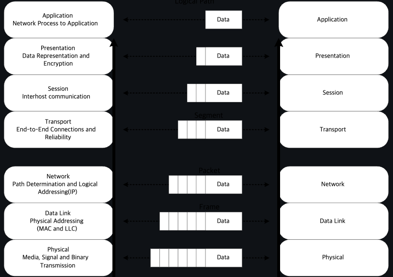

= 정리

== 5.Computer Network

.Node
* Computing device간 메시지 전달을 위해 중간 연결 역할을 수행하는
다양한 디바이스를 말한다.
** 종류 : Network Interface, Repater and Hub, Bridge, Switch,
Router, Modem, Firewall

.Network Interface
* 컴퓨터와 개인 또는 공용 네트워크 간의 상호 연결 지점
* 일반적으로은 NIC(Network Interface Controller)와 같이 물리적인
디바이스를 이야기 하지만, Loopback interface와 같이 가상 디바이스로도 구현 가능
** Loopback Interface : 물리적으로 연결하는 port가 존재하지 않는
논리적인 port이다. Test 등을 목적으로 네트워크를 추가 시 사용할 수
있는 Interface.

.1계층
* Repeater, Hub
** Repeater는 1:1 통신, Hub는 1:N 구조로 입력된 신호는 여러 포트로 출력됨.

.2계층
* Bridge, Switch
** Bridge는 1:1, Switch는 둘 이상의 network segment를 연결.

.3계층
* Router

.Protocol
* 네트워크를 통해 정보를 교환하기 위한 일련의 규칙이다. 연결 지향적 일 수도 있고 비연결 적일 수도 있고, 회선 모드 나 패킷 전환을 사용할 수도 있고, 계층적 주소 지정이나 평면적 주소 지정을 사용할 수도 있다.
* OSI 모델에 따라 구성되는 프로토콜 스택 에서 통신 기능은 프로토콜 계층으로 나누어진다.
* 각 계층은 가장 낮은 계층이 미디어를 통해 정보를 전송하는 하드웨어를 제어할 때까지 하위 계층의 서비스를 활용한다.
* 프로토콜 계층화의 사용은 컴퓨터 네트워킹 분야 전반에 걸쳐 널리 사용된다.

.Network layer
* 데이터를 네트워크를 통해 전송하는 소프트웨어는 패킷 간 충돌을 피하고, 디지털 데이터를 아날로그 신호로 변환하며, 오류를 감지하고 수정하며, 패킷을 호스트에서 다른 호스트로 경로 지정하고 등 다양한 작업을 이해해야 한다.

.Major Task
* Collision Avoidance
* Digital to Analog Conversion
* Error Detetion and Correction
* Routing
* Operating System Compatibility
* Heterogeneous Network Cabling
* Network Protocols
* Security
* Quality of Service
* Scalability
* 네트워크를 통해 데이터를 전송하는 것은 실제로 복잡한 작업이며, 네트워크 소프트웨어는 이러한 복잡성을 관리하는 데 중요한 역할을 한다. 이는 물리적 계층(예: 케이블 및 신호)부터 논리적 계층(예: 데이터 형식 및 라우팅)까지 모든 측면을 처리하면서 호환성, 보안 및 확장성 문제를 다루어 다양한 네트워크 환경에서 데이터를 신뢰성 있고 효율적으로 전송할 수 있도록 해야 한다.

.Protocol Stack
]

.OSI Model

* Physical Layer: 이 계층은 실제 데이터 전송을 다룹니다(전선, 광섬유 등). 하드웨어 특성, 신호 및 전송 속도를 정의한다.
* Data Link Layer계층: 이 계층은 직접 연결된 두 노드 간의 신뢰할 수 있는 링크를 만듭니다. 프레임 형식, 오류 감지 및 흐름 제어와 같은 문제를 처리한다. Ethernet은 데이터 링크 계층 기술의 예입니다.
* Network Layer: 네트워크 계층은 다중 연결된 네트워크를 통해 패킷을 출발지에서 목적지로 라우팅한다. IP(Internet Protocol)가 이 계층에서 작동한다.
* Transport Layer: 이 계층은 발신자와 수신자 간의 종단 간 통신을 보장한다. 데이터 분할, 흐름 제어 및 오류 정정을 관리한다. TCP(Transmission Control Protocol) 및 UDP(User Datagram Protocol)는 전송 계층 프로토콜입니다.
* Session Layer: 이 계층은 통신 세션을 설정, 관리 및 종료한다. 세션 동기화 및 대화 제어를 처리한다.
* Presentation Layer: 데이터 번역, 압축 및 암호화를 담당한다. 데이터가 발신자와 수신자 양쪽에서 읽을 수 있는 형식으로 제공됨을 보장한다.
* Application Layer: 가장 상위 계층으로 응용 프로그램별 프로토콜 및 데이터 형식을 처리한다. 웹 브라우저, 이메일 클라이언트 및 파일 전송 소프트웨어와 같은 사용자 수준 응용 프로그램이 작동하는 곳입니다.

.TCP / IP MODEL

* Host-to-Network Layer
** Host-to-Network(네트워크 인터페이스라고도 함)는 가장 낮은 TCP/IP 계층로, 패킷을 수신하고 특정 네트워크를 통해 전송하는 역할을 담당한다. Network interface는 장치 드라이버 또는 자체 데이터 링크 프로토콜을 사용하는 복잡한 서브시스템으로 구성될 수 있다.
* Internet Protocol(IP) Layer
** Internet protocol layer는 한 대의 기계에서 다른 대의 기계로의 통신을 처리한다. 이 layer는 transport layer에서 데이터를 전송하도록 요청을 수락하며, 데이터를 전송할 기계의 식별 정보와 함께 받는다. 그런 다음 데이터를 IP 데이터그램으로 래핑하고 데이터그램 헤더를 채우며, 데이터그램을 전달 방법을 결정하기 위해 라우팅 알고리즘을 사용하고 데이터그램을 전송하기 위해 적절한 장치 드라이버에 전달한다.
** IP는 연결 없는 "신뢰할 수 없는" 패킷 전달 서비스를 제공하여 패킷을 한 시스템에서 다른 시스템으로 라우팅한다.
* Transport Layer
** Transport layer의 주요 목적은 한 응용 프로그램에서 다른 응용 프로그램으로의 통신을 제공하는 것이다. 소프트웨어는 전송되는 데이터 스트림을 ISO 용어로 패킷이라고 하는 더 작은 조각으로 나누고 각 패킷과 목적지 정보를 다음 레이어로 전달한다.
** 이 layer는 connection-oriented transport service(COTS)인 Transport Control Protocol(TCP)과 connectionless transport service(CLTS)인 User Datagram Protocol(UDP)로 구성된다.
* Application Layer
** Application layer는 TCP/IP 인터넷 전체에서 사용 가능한 서비스에 접근하는 사용자 호출 응용 프로그램으로 구성된다. 응용 프로그램은 데이터를 전송 레이어로 전달하기 위해 필요한 형식으로 전달한다.

== 6. DNS

.Domain Name Service(DNS)
* 컴퓨터 네트워크에서 사용되는 계층화된 분산 데이터베이스 시스템이다. DNS의 주요 목적은 사람이 이해할 수 있는 도메인 이름(예: www.example.com)을 컴퓨터가 이해할 수 있는 IP 주소(예: 192.168.1.1)로 변환하거나 그 반대로 IP 주소를 도메인 이름으로 변환하는 것이다.

.DNS의 역할과 구성 요소
* 도메인 이름 해석 (Name Resolution): DNS는 사용자가 입력한 도메인 이름을 해당 도메인에 대한 IP 주소로 해석합니다. 이것은 웹 브라우징, 이메일 통신, 파일 공유 및 다른 네트워크 활동에서 중요한 역할을 합니다.
* 계층 구조: DNS는 계층 구조를 가지고 있으며, 최상위 수준의 도메인(TLD, Top-Level Domain)에서부터 하위 수준 도메인(subdomain)까지 내려가는 방식으로 도메인 이름을 구성합니다. 예를 들어, "www.example.com"에서 ".com"은 최상위 수준 도메인이고 "example.com"은 하위 수준 도메인입니다.
* DNS 서버: DNS 정보는 전 세계에 분산된 DNS 서버에 저장되어 있으며, 이들은 계층적인 구조를 가집니다. 루트 서버, 최상위 도메인 서버, 중간 도메인 서버 및 기업 또는 ISP(인터넷 서비스 제공업체)의 로컬 DNS 서버 등이 있습니다.
* DNS 쿼리: 컴퓨터 또는 장치가 도메인 이름을 IP 주소로 변환하려면 DNS 쿼리를 보내야 합니다. 이 쿼리는 사용자 요청에 따라 로컬 DNS 서버 또는 상위 DNS 서버로 전달되고, 최종적으로 도메인에 대한 IP 주소를 반환합니다.
* DNS 캐싱: DNS 서버는 이전에 검색한 도메인 이름에 대한 결과를 캐싱하여 빠른 응답을 제공합니다. 이를 통해 동일한 도메인 이름에 대한 반복적인 쿼리를 줄일 수 있습니다.

== 7. L7 Application Layer

== 8. L4 Transport Layer

* Transport layer은 데이터 패킷이 전송 순서대로 받아지고 데이터가 손실되거나 손상되지 않도록 보장하는 역할을 한다. 패킷이 손실된 경우, 전송 계층은 송신자에게 패킷 재전송을 요청할 수 있다. IP 네트워크에서는 이를 각 데이터그램에 추가 정보를 포함하는 추가 헤더를 추가함으로써 구현한다.
** TCP : 높은 오버헤드 프로토콜로서 손실된 데이터나 손상된 데이터의 재전송 및 전송된 바이트의 순서대로 전달을 허용한다.
** UDP : User Datagram Protocol (UDP)로, 수신자는 손상된 패킷을 감지할 수 있지만 패킷이 올바른 순서로 전달되는 것을 (또는 아예 전달되는 것을) 보장하지 않는다. 그러나 UDP는 종종 TCP보다 빠르다. TCP는 신뢰성 있는 프로토콜로, UDP는 신뢰성 없는 프로토콜이다. 나중에 신뢰성 없는 프로토콜이 앞서 이야기한 것보다 훨씬 유용하다는 것을 보게 될 것이다.

.UDP
* checksum 정도만 제공
** 보내는 패킷의 데이터가 전송 도중 잘못 되지는 않았는지 정도만.
* TCP에 비해 상대적으로 빠를 가능성이 있음
Format

                  0      7 8     15 16    23 24    31
                 +--------+--------+--------+--------+
                 |     Source      |   Destination   |
                 |      Port       |      Port       |
                 +--------+--------+--------+--------+
                 |                 |                 |
                 |     Length      |    Checksum     |
                 +--------+--------+--------+--------+
                 |
                 |          data octets ...
                 +---------------- ...
                      User Datagram Header Format

.TCP
* 출발지 포트번호, 목적지 포트번호
* 세그먼트가 목적지에 도착하면, OS 는 목적지 포트번호로 애플리케이션(프로세스)을 식별
** 해당 애플리케이션에 전달.
TCP Header Format

    0                   1                   2                   3
    0 1 2 3 4 5 6 7 8 9 0 1 2 3 4 5 6 7 8 9 0 1 2 3 4 5 6 7 8 9 0 1
   +-+-+-+-+-+-+-+-+-+-+-+-+-+-+-+-+-+-+-+-+-+-+-+-+-+-+-+-+-+-+-+-+
   |          Source Port          |       Destination Port        |
   +-+-+-+-+-+-+-+-+-+-+-+-+-+-+-+-+-+-+-+-+-+-+-+-+-+-+-+-+-+-+-+-+
   |                        Sequence Number                        |
   +-+-+-+-+-+-+-+-+-+-+-+-+-+-+-+-+-+-+-+-+-+-+-+-+-+-+-+-+-+-+-+-+
   |                    Acknowledgment Number                      |
   +-+-+-+-+-+-+-+-+-+-+-+-+-+-+-+-+-+-+-+-+-+-+-+-+-+-+-+-+-+-+-+-+
   |  Data |           |U|A|P|R|S|F|                               |
   | Offset| Reserved  |R|C|S|S|Y|I|            Window             |
   |       |           |G|K|H|T|N|N|                               |
   +-+-+-+-+-+-+-+-+-+-+-+-+-+-+-+-+-+-+-+-+-+-+-+-+-+-+-+-+-+-+-+-+
   |           Checksum            |         Urgent Pointer        |
   +-+-+-+-+-+-+-+-+-+-+-+-+-+-+-+-+-+-+-+-+-+-+-+-+-+-+-+-+-+-+-+-+
   |                    Options                    |    Padding    |
   +-+-+-+-+-+-+-+-+-+-+-+-+-+-+-+-+-+-+-+-+-+-+-+-+-+-+-+-+-+-+-+-+
   |                             data                              |
   +-+-+-+-+-+-+-+-+-+-+-+-+-+-+-+-+-+-+-+-+-+-+-+-+-+-+-+-+-+-+-+-+
                            TCP Header Format
          Note that one tick mark represents one bit position.

.Well-Known 포트
* 프로토콜에 고정 포트번호를 부여하는 경우
* HTTP 80 - 브라우저에 주소창에 명시하지 않아도 http 프로토콜은 80 포트를 사용
* http://naver.com, http://naver.com:80
* DNS -> 53, SMTP -> 25

.전송계층 > TCP
* 신뢰성을 보장하기 위한 필드들
* Sequence Number - 순서번호
* Acknowledge Number - 어디까지 잘 받았는지, 다음 번 보낼 패킷의 Sequence Number 를 응답
* Flags
** ACK
** RST
** SYN
** FIN
* Window Size

.Flow Control
* TCP 헤더의 윈도우 크기
* 수신 애플리케이션의, 데이타 수신 속도와 관계가 있음.

.Congestion Control
* network는 명시적으로 혼잡도를 알려주지 않음.
* TCP가 열심히 추측해야 함.

.Congestion Control
* CWND - 한 번에 ACK 없이 보낼 수 있는 세그먼트의 숫자
* 프로토콜 상에 드러나지 않는 값.
* 송신측에서 제어

== 9. L3 Network Layer

* Path Determination and Logical Addressing(IP)
* 데이터를 전송. 경로를 결정

.Ip Internet Protocol - IPv4

* TTL- Time To Live
* Protocol
* 6 TCP
* 17 UDP
* Checksum
* IP

.Subnet mask
* 네트워크 ID를 표시 하기 위해 사용

.Subnet
* 라우터를 통하지 않고 갈 수 있는 네트워크
** 223.1.1 223.1.2 223.1.3

.IP Addressing: CIDR Classless InterDomain Routing
* 임의의 길이로 서브넷을 할 수 있음.

=== Network Layer - 라우터
.Forwarding
* 데이터를 전달
* 포워딩 테이블을 참조해 데이터 전달
* 네트워크 ID 기준

.Routing
* 포워딩 테이블을 만듦

=== Forwarding
[source]
----
|      | Network destination | Netmask         | Gateway       | Interface     | Metric |
| :--- | :------------------ | :-------------- | :------------ | :------------ | :----- |
| 1    | 0.0.0.0             | 0.0.0.0         | 192.168.0.1   | 192.168.0.100 | 10     |
| 2    | 127.0.0.0           | 255.0.0.0       | 127.0.0.1     | 127.0.0.1     | 1      |
| 3    | 192.168.0.0         | 255.255.255.0   | 192.168.0.100 | 192.168.0.100 | 10     |
| 4    | 192.168.0.100       | 255.255.255.255 | 127.0.0.1     | 127.0.0.1     | 10     |
| 5    | 192.168.0.1         | 255.255.255.255 | 192.168.0.100 | 192.168.0.100 | 10     |
----
.Longest prefix matching
* 192.168.0.100은 3번, 4번 규칙에 모두 적용가능 -> 가장 긴 prefix가 매치하는 곳의 규칙을 따라 포워딩

.Nat: Network Address Translation
* IP 고갈을 걱정하여 만들어 낸 기능
* SRC PORT도 변경이 됨
* 서버 입장에서 클라이언트 IP가 동일하게 보이는 현상이 있을 수 있음.

.Private IP
* 사설 IP 대역이 정의되어 있음. 공인 IP로는 사용되지 않음.

[source]
----
| Name         | CIDR block     | Address range                 | Number of addresses | Classful description                    |
| :----------- | :------------- | :---------------------------- | :------------------ | :-------------------------------------- |
| 24-bit block | 10.0.0.0/8     | 10.0.0.0 – 10.255.255.255     | 16777216            | Single Class A.                         |
| 20-bit block | 172.16.0.0/12  | 172.16.0.0 – 172.31.255.255   | 1048576             | Contiguous range of 16 Class B blocks.  |
| 16-bit block | 192.168.0.0/16 | 192.168.0.0 – 192.168.255.255 | 65536               | Contiguous range of 256 Class C blocks. |
----

.NAT 환경의 단점
* 서버 운영이 불가능
* 서로 다른 NAT 환경의 두 호스트가 직접 통신하는 것은 어려움.

.IP Fragmentation
* 데이터그램의 크기가 네트워크에서 전송할 수 있는 최대 크기보다 큰 경우, IP 프로토콜이 데이터그램을 여러 작은 조각으로 분할하는 과정을 말한다.
* 헤더에 있는 offset정볼르 이용해 조각들을 올바르게 재조립해 원래의 데이터그램을 복원한다.
* 효율적인 데이터 전송을 가능하게 하나, 오버헤드를 발생시키고, 조각이 유실되거나 손상된 경우 전체 데이터 그램을 복구할 수 없을 가능성이 있다.
** 일부 응용프로그램이나 프로토콜은 데이터그램 크기를 MTU에 맞게 조절하거나, 데이터그램을 분할하지 않는 것이 더 효율적일 수 있다.

.DHCP: Dynamic Host Control Protocol
* 개별 호스트에 적절한 네트워크 정보를 설정하기 위한 프로토콜
* IP
* Subnet mask or prefix
* Router
* DNS

.ICMP: Internet Control Protocol
* 네트워크 상태를 보고하기 위한 메세지
* TTL을 넘어가는 경우, source에 알려줌

[source]
----
Type  Code  description
0        0         echo reply (ping)
3        0         dest. network unreachable
3        1         dest host unreachable
3        2         dest protocol unreachable
3        3         dest port unreachable
3        6         dest network unknown
3        7         dest host unknown
4        0         source quench (congestion
                     control - not used)
8        0         echo request (ping)
9        0         route advertisement
10       0         router discovery
11       0         TTL expired
12       0         bad IP header
----

.라우팅 알고리즘 - link-state 알고리즘
* 라우팅 테이블을 구성하는 알고리즘
* 전체 그래프 상태를 모두 알고 있는 상태로 가정
** 서로 알고 있는 정보를 broadcasting
* Shortest Path Algorithm - Dijkstra
* OSPF Open Shortest Path First

.라우팅 알고리즘 - distance-vector 알고리즘
* 전체 그래프는 모르지만, 이웃으로 부터 이웃이 알고 있는 정보를 받아서 계산하는 방법
* RIP Routing Information Protocol

.라우팅 프로토콜
* IGP Interior gateway protocol
** link-state 알고리즘
** distance-vector 알고리즘
* EGP Exterior gateway protocol
** BGP Border Gateway Protocol

.Autonomous System
* Autonomous 자치권을 가진 시스템
* 네트워크를 독립적으로 운영할 수 있는 단위
** 회사, ISP ....
* AS 내에서는 IGP 를 사용

.BGP Border Gateway Protocol
* AS 간 라우팅에 사용하는 알고리즘. inter AS 라우팅
* AS 는 AS Number 를 부여 받음
** link:https://한국인터넷정보센터.한국/jsp/business/management/asList.jsp[]
* AS 간 라우팅은 계약에 따라서 진행
* AS 간에 어떻게 연결되어 있는지 확인 가능.
** https://bgpview.io/