= Java Network Programming

== Socket
* Network에서 정보가 전송되는 고유 식별자.
* 32비트의 숫자로 지정된다. -> 짝수는 수신 socket, 홀수는 송신 socket (현재는 양방향 통신이라 구분 X.)
* 송신 또는 수신 processor가 위치한 host에 의해서 식별된다.

=== port
물리적 I/O device거나 host의 OS에 대한 시스템 호출에서 지원되는 논리적 I/O device.

{empty} +

* 소켓은 ARPA 네트워크를 통한 기계간 통신을 위한 port의 식별자.
** ARPANRT - Advanced Research Projects Agency Network
** 세계 최초의 패킷 스위칭 네트워크 인터넷의 원형이다.
* 각 host에 할당된 소켓은 알려진 프로세스와 고유하게 연결되거나 정의되지 않아야 한다.
* 몇몇의 소켓의 이름은 일반적으로 알려져 있으며 지정된 프로토콜로 작동하는 알려진 프로세스와 연결되어 있어야 한다.
** logger socket, RJE socket, file transfer socket.
* 일반적으로 소켓의 이름은 알려져 있지 않을 수 있지만 소켓을 통한 전송에서 이름이 지정된다.
* 네트워크를 통한 통신은 한 소켓에서 다른 소켓으로 이루어 진다.
** host에서 실행되는 프로세스와 연관된 각각의 소켓

== Socket Type

Datagram Sockets::
* UDP(User Datagram Protocol)을 사용하는 무연결 소켓
* 소켓에서 보내거나 받은 패킷은 개별적으로 주소가 지정되고 라우팅 된다.
* 순서와 신뢰성이 보장되지 않으므로 패킷이 임의의 순서로 도착하거나 도착하지 않을 수 있다.

{empty} +

Stream Sockets::
* 연결 지향 소켓
** TCP(Transmission Control Protocol)
** SCTP(Stream Control Transmission Protocol)
** DCCP(Datagram Congestion Control Protocol)
* 오류 없는 데이터 전송, 패킷 순서, 흐름 제어 보장
* 송신 순서에 따라서 전송되므로 overhead가 발생할 수 있다.

{empty} +

Raw Sockets::
* 프로토콜 별 전송 계층 형식 없이 IP 패킷을 직접 보내고 받을 수 있다.
* NMap과 같은 보안 관련 application에서 사용한다.
* IGMP와 OSPF 같은 라우팅 프로토콜에 사용한다.

== Socket 통신

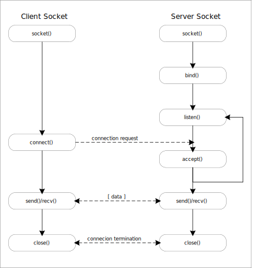

Server Socket::
client socket의 연결 요쳥을 대기하고, 연결 요청이 오면 client socket을 생성하여 통신이 가능하도록 한다.
* **동작 순서**
** socket() 함수로 소켓을 생성한다.
** bind() 함수로 IP주소와 port를 설정한다.
** listen() 함수로 연결 요청을 대기한다.
** accept() 함수로 연결을 승인하고 client 소켓과 통신을 위한 소켓을 생성한다.
** listien() 함수를 통해 추가적인 연결 요청을 대기하고 생성된 소켓으로 client와 데이터를 송수신 한다.
** client나 생성된 소켓을 닫으면 연결된 상태 소켓도 닫힌다.

Client Socket::
client 프로그램이나 server에서 생성할 수 있다.
* **동작 순서**
** socket()을 이용해 소켓을 생성한다.
** connect() 함수를 이용해 서버에 연결 요청을 전송한다,
** 서버에서 accept()함수로 연결을 승인하면 데이터 송수신을 시작한다.

== Java Socket 통신

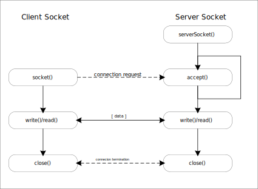

Class Socket::
[source]
----
Socket socket = new Socket(hostIp, port)
----
* Socket 생성과 함께 server에 연결을 요청한다.
* Socket 생성자에는 연결을 위한 server 정보가 제공 되어야 한다.

**Echo Server**

* Client가 Server에 연결하여 데이터를 전송하면 Server는 데이터를 받아서 그대로 돌려준다.

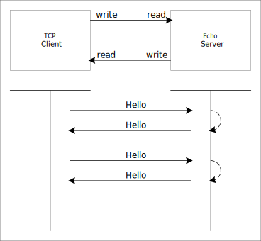

비동기 통신 만들기::
Echo server의 경우 보낸 데이터를 그대로 돌려준다. 하지만 chatting과 같이 보내는것과 받는 것이 별도로 동작하는 경우 thread를 이용해 두 과정이 따로 동작할 수 있도록 구성해야 한다.

=== Server Socket
* ServerSocket class를 이용한다. socket을 생성하고 binding 과정까지 같이 수행한다.
* accpet() 함수로 client 연결을 기다린다. 연결에 성공하면 socket을 생성하여 반환하며 해당 소켓으로 client와 데이터 송수신을 수행한다.

=== Broadcasting Server
* Broadcasting : data를 연결할 수 있는 모든 접속자에게 전달하는 것.

== Computer Network
* 서로 데이터를 교환하고 리소스를 공유할 수 있는 Computing device의 집합

{empty} +

Node::
장치간 메시지 전달을 위해 중간 연결 역할을 수행하는 장치.

[frame=ends, cols="1,1"]
|===
^s| 종류
^s| 설명

| Network Interface
| 컴퓨터와 개인 또는 공용 네트워크 간 상호 연결 지점. +
NIC(Network Interface Controller), Loopback interface 처럼 가상 디바이스로도 구현이 가능하다.

| Repeater
| 장거리 전송시 물리적인 영향이나 외부 영향에 따른 신호 품질 저하를 줄인다. (신호 증폭으로 장거리 전송에 따른 신호 감소 문제 해결. 신호 처리를 통한 외부 노이즈 제거) +
전송 거리나 환경 요인을 극복하기 위해 전송 매체를 변경할 수 있다. (장거리 전송에는 금속을 이용한 케이블보다 광 케이블이 적합.)

| Hub
| Repeater는 1:1 통신에 들어가고, Hub는 1:N 구조로 입력된 신호를 여러 포트로 출력한다.

| Bridge
| OSI 계층의 network 계층에서 동작한다. +
Network간 패킷 전달에 이용된다. +
라우팅 정보를 이용해 패킷의 경로를 정할 수 있다.

| Modem (Modulator-Demodulator)
| 디지털 데이터를 아날로그 신호로 변환하거나 아날로그 신호를 디지털 데이터로 변환한다.

| Firewall
| 네트워크 보안 및 액세스 규칙을 제어하기 위한 장치 또는 소프트웨어. +
안전한 내부 네트워크와 안전하지 않은 외부 네트워크(인터넷) 연결에 삽입된다. +
일반적으로 사전에 승인되지 않은 접근에 대해서 차단을 기본으로 한다.

|===

{empty} +

Protocol::
* 네트워크를 통해 정보를 교환하기 위한 일련의 규칙.
* OSI 모델에 따라 구성되는 프로토콜 스택에서 통신 기능은 프로토콜 계층으로 나누어진다.
* 예시 ) IEEE 802.11 (Wi-Fi 프로토콜), IP(인터넷 프로토콜)를 통한 TCP를 통해 실행되는 HTTP (WWW protocol).

{empty} +

Network 계층::

[frame=ends, cols="1,1"]
|===
^s|
^s| 설명

| Collision Avoidance (충돌 회피)
| 이더넷과 같은 공유 네트워크 환경에서 여러 기기가 동시에 데이터를 전송하려고 할 때 충돌이 발생할 수 있다. +
CSMA/CD (Carrier Sense Multiple Access with Collision Detection), CSMA/CA (Carrier Sense Multiple Access with Collision Avoidance) 같은 프로토콜이 충돌을 회피하도록 도와준다.

| Digital to Analog Convension
| 디지털 데이터를 물리적인 매체를 통해서 전송하기 위해서는 아날로그 신호로 변환할 필요가 있다.

| Error Detection and Correction (오류 감지와 수정)
| 데이터가 전송 중일 때 다양한 요인에 의해 손상될 수 있다. +
Check Sum, Parity Bit, Reed-Solomon 코드 같은 오류 감지 및 수정 기술을 사용하여 데이터 무결성을 보장해 주어야 한다.

| Routing (경로 지정)
| OSPF, BGP, RIP 같은 경로 지정 프로토콜을 통해 패킬이 목적지에 도달하기 위한 경로를 결정한다.

| Operating System Compatibility (OS 호환성)
| 네트워크의 다양한 장치가 서로 다른 운영 체제를 사용할 수 있기 때문에 다른 운영 체제와 호환되어야 한다.

| Heterogeneous Network Cabling (이질적인 네트워크 케이블링)
| 다양한 종류의 케이블을 포함한 물리적 인프라를 가질 수 있기 때문에 이런 차이를 처리하고 사용된 케이블링의 특성에 적응해야 한다.

| Network Protocols
| TCP/IP, UDP, HTTP, FTP 등 +
데이터의 구조, 전송 및 수신 방식을 규정한다. +
호환성과 신뢰성 있는 데이터 전송을 보장할 수 있다.

| Security
| 암호화, 인증 등

| Quality of Service(QoS)
| 중요한 데이터가 우선 처리되도록 보장한다.

| Scalability (확장성)
| 증가하는 데티터 트래픽 및 장치 연결을 수용하기 위해 효율적으로 확장 가능해야 한다.
|===

{empty} +

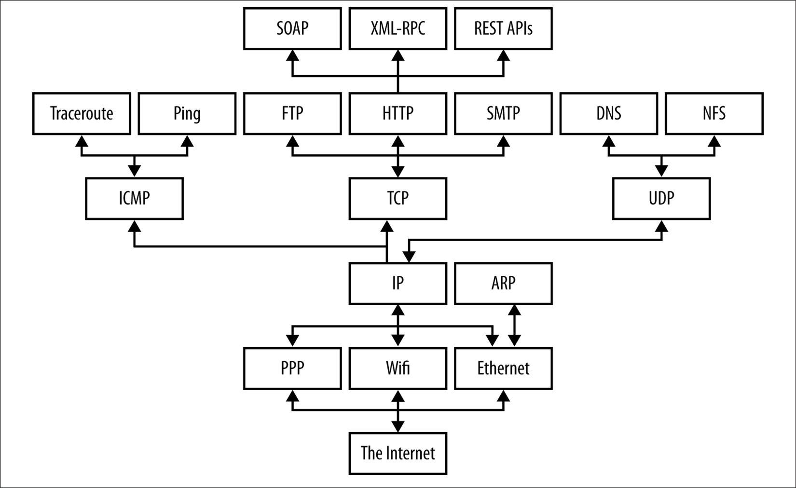

* 계층 모델은 응용 프로토콜을 네트워크 하드웨어의 물리적인 특성과 네트워크 연결의 토폴로지를 분리한다.

{empty}

OSI Model::

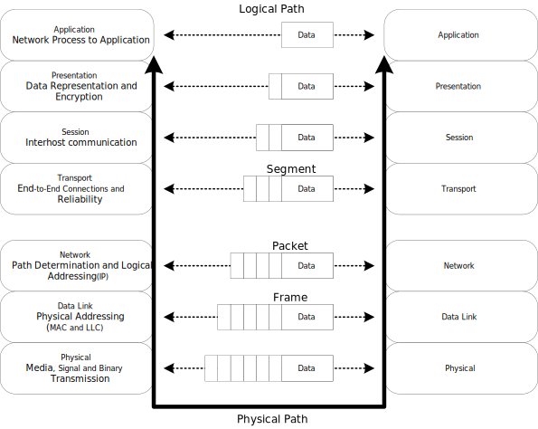

[frame=ends, cols="1,1"]
|===
^s|Layer
^s|

| Physical
| 실제 데이터 전송을 다룬다.

| Data Link
| 직접 연결된 두 노드 간의 신뢰할 수 있는 링크를 만든다. 프레임 형식, 오류 감지 및 흐름 제어를 처리한다. (Etherent)

| Network
| 다중 연결된 네트워크를 통해 패킷을 출발지에서 목적지로 라우팅한다. IP가 작동하는 계층

| Transport
| 발신자와 수신자 간의 종단 간 통신 보장. 데이터 분할, 흐름 제어 및 오류 정정 관리. TCP, UDP

| Session
| 통신 세션을 설정, 관리 및 종료. 세션 동기화 및 대화 제어 처리.

| Presentation
| 데이터 번역, 압축 및 암호화 담당. 데이터가 양쪽에서 읽을 수 있는 형식으로 제공됨을 보장.

| Application
| 응용 프로그램별 프로토콜 및 데이터 형식 처리. 사용자 수준 응용 프로그램이 작동하는 곳. (Web browser, Email Client ...)
|===

{empty} +

TCP/IP Model::

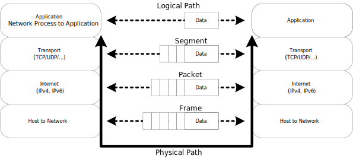

[frame=ends, cols="1,1"]
|===
^s|Layer
^s|

|Host-to-Network(또는 네트워크 인터페이스)
|패킷을 수신하고 특정 네트워크를 통해 전송하는 역할.

|Internet Protocol(IP)
|한 대의 기계에서 다른 기계로의 통신을 처리. transport 계층에서 데이터를 전송하도록 요청을 수락하고, 데이터를 전송할 기계에 대한 정보를 함께 받는다. +
IP 계층은 OSI 참조 모델에서 네트워크 계층에 해당한다. 연결 없는 "신뢰할 수 없는" 패킷 전달 서비스를 제공한다.

|Transport
|한 응용 프로그램에서 다른 응용 프로그램으로의 통신을 제공한다. 데이터 스트림을 더 작은 조각인 패킷으로 나누워 패킷과 목적지 정보를 다음 계층으로 전달한다.

|Application
|TCP/IP 인터넷 전체에서 사용 가능한 서비스에 접근하는 사용자 호출 응용 프로그램으로 구성된다.데이터를 transport 계층으로 전달하기 위해 필요한 형식으로 전달.
|===

== DNS (Domain Name Service)

* 컴퓨터 네트워크에서 사용되는 계층화된 분산 DB 시스템.
* 사람이 이해할 수 있는 도메인 이름 (ex : www.example.com)을 컴퓨터가 이해할 수 있는 IP 주소로 변환하거나 그 반대로 IP 주소를 도메인 이름으로 변환한다.

=== 역할 및 구성 요소

* 도메인 이름 해석
** 사용자가 입력한 도메인 이름을 IP 주소로 해석한다. 웹 브라우징, 이메일 통신, 파일 공유 등의 활동에서 중요한 역할을 한다.
* 계층 구조
** www.example.com에서 .com은 최상위 수준 도메인, example.com은 하위 수준 도메인.
* DNS 서버
** DNS 정보는 전 세계에 분산된 DNS 서버에 저장되어 있다.
** 루트 서버, 최상위 도메인 서버, 중간 도메인 서버 및 기업 또는 ISP의 로컬 DNS 등이 있다.
* DNS 캐싱
** 이전에 검색한 도메임 이름에 대한 결과를 캐싱하여 빠른 응답을 제공한다. 동일한 도메인 이름에 대한 반복적인 쿼리를 줄일 수 있다.

{empty}

기능::
* A - 도메인에 대한 IP 응답
* NS - 특정 도메인에 대한 Name Server 정보 응답
* CNAME - Canonical Name 설정
* MX - 도메인의 메일 수신 서버 주소를 응답
* TXT - 임의 문자열 부가 정보 관리, SPF, DKIM 용으로도 사용
* SRV - IP 외에 Port 번호까지 서비스 가능

부하 분산::
* 하나의 도메인에 여러 개의 IP를 등록할 수 있다.
* 클라이언트는 응답 받은 여러 IP 중에서 하나를 사용한다.

=== DNS Query Flow
* Local DNS에 캐싱되어 있는 경우에 바로 응답한다.
* 캐싱이 되어 있지 않다면 ROOT DNS, TLD DNS, Authoratative DNS 순으로 질의하여 결과를 응답한다.

== L7 Application Layer

* 데이터를 사용자에게 전달하는 계층
* Host-to-Network, Internet, Transport 계층은 한 컴퓨터에서 다른 컴퓨터로 전송하는 방법을 정의하는데 협력한다.
* Application 계층은 HTTP와 같은 protocol이 웹 브라우저가 그래픽 이미지를 숫자의 긴 스트림이 아닌 그림으로 표시하도록 보장하는 것 처럼 데이터가 전송된 후에 어덯게 처리할지를 결정한다.
** 웹 -> HTTP
** 이메일 -> SMTP, POP, IMAP
*** SMTP (Simple Mail Transfer Protocol)
*** POP (Post Office Protocol)
*** IMAP (Internet Message Access Protocol)
** 파일 전송 -> FTP, FSP, TFTP
*** FTP (File Transfer Protocol) : TCP 기반의 프로토콜으로 신뢰성 있고 연결지향적인 파일을 송수신 한다.
*** FSP (File Service Protocol) : FTP를 대체하는 UDP 기반의 프로토콜, FTP보다 하드웨어 및 네트워크 요구 사항이 낮은 익명 액세스용으로 설계되었다.
*** TFTP (Trivial File Transfer Protocol) : FTP에 비해 단순하고 빠르게 파일을 전송한다. UDP 기반 프로토콜로 보안에 취약하고 비연형 파일 전송 프로토콜이다.
** 파일 접근 -> NFS (Network FIle System) : 클라이언트가 네트워크 상의 파일을 직접 연결된 스토리지에 접근하는 방식. (네트워크에 파일을 저장한다.)
** 파일 공유 -> Gnutella, BitTorrent
** 음성 통신 -> Session Initiation Protocol (SIP), Skype

{empty} +

HTTP::
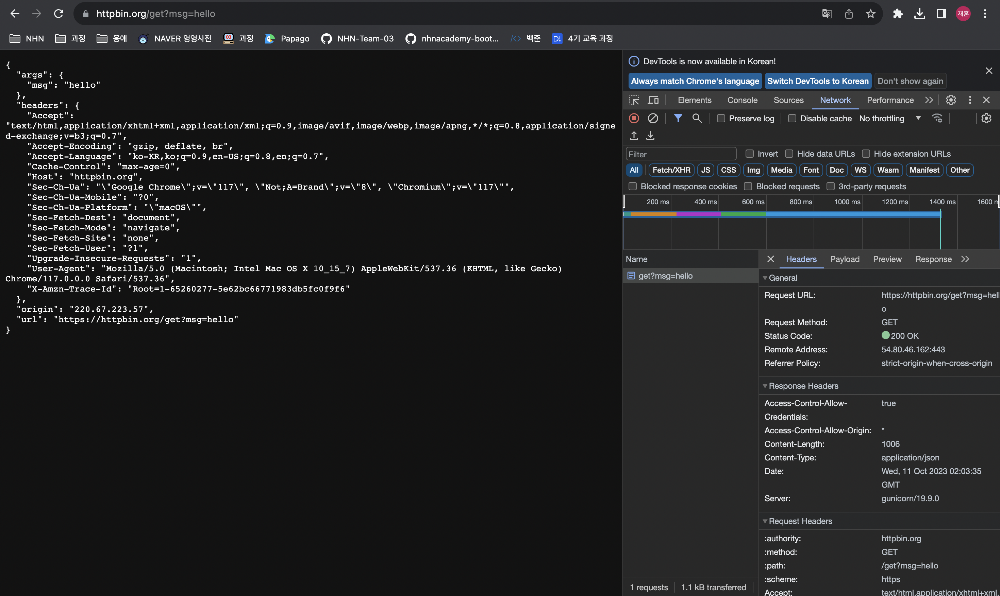

DNS::
[source]
----
$ nslookup httpbin.org
$ nslookup nhnacademy.com
----

== L4 Transport Layer

데이터 패킷이 전송 순서대로 받아지고 데이터가 손실되거나 손상되지 않도록 보장한다. 패킷이 손실된 경우 송신자에게 재전송을 요청할 수 있다. IP 네트워크에서는 각 데이터그램에 추가 정보를 포함하는 추가 헤더를 추가함으로써 구현한다.

* TCP (Transmission Control Protocol) : 높은 오버헤드 프로토콜, 손실된 데이터나 손상된 데이터의 재전송 및 전송된 바이트의 순서대로 전달을 허용한다. 신뢰성 있는 프로토콜이다.
* UDP (User Datagram Protocol) : 수신자는 손상 패킷을 감지할 수 있지만 패킷의 전달 순서는 보장하지 않는다. 신뢰성 없는 프로토콜이다.

{empty}

UDP::
CheckSum 정도만 제공한다. (보내는 패킷이 전송도중 잘못 되지는 않았는지 정도만 확인한다.)

[source]
----
Format

                  0      7 8     15 16    23 24    31
                 +--------+--------+--------+--------+
                 |     Source      |   Destination   |
                 |      Port       |      Port       |
                 +--------+--------+--------+--------+
                 |                 |                 |
                 |     Length      |    Checksum     |
                 +--------+--------+--------+--------+
                 |
                 |          data octets ...
                 +---------------- ...

                      User Datagram Header Format
----

TCP::
[source]
----
  TCP Header Format

    0                   1                   2                   3
    0 1 2 3 4 5 6 7 8 9 0 1 2 3 4 5 6 7 8 9 0 1 2 3 4 5 6 7 8 9 0 1
   +-+-+-+-+-+-+-+-+-+-+-+-+-+-+-+-+-+-+-+-+-+-+-+-+-+-+-+-+-+-+-+-+
   |          Source Port          |       Destination Port        |
   +-+-+-+-+-+-+-+-+-+-+-+-+-+-+-+-+-+-+-+-+-+-+-+-+-+-+-+-+-+-+-+-+
   |                        Sequence Number                        |
   +-+-+-+-+-+-+-+-+-+-+-+-+-+-+-+-+-+-+-+-+-+-+-+-+-+-+-+-+-+-+-+-+
   |                    Acknowledgment Number                      |
   +-+-+-+-+-+-+-+-+-+-+-+-+-+-+-+-+-+-+-+-+-+-+-+-+-+-+-+-+-+-+-+-+
   |  Data |           |U|A|P|R|S|F|                               |
   | Offset| Reserved  |R|C|S|S|Y|I|            Window             |
   |       |           |G|K|H|T|N|N|                               |
   +-+-+-+-+-+-+-+-+-+-+-+-+-+-+-+-+-+-+-+-+-+-+-+-+-+-+-+-+-+-+-+-+
   |           Checksum            |         Urgent Pointer        |
   +-+-+-+-+-+-+-+-+-+-+-+-+-+-+-+-+-+-+-+-+-+-+-+-+-+-+-+-+-+-+-+-+
   |                    Options                    |    Padding    |
   +-+-+-+-+-+-+-+-+-+-+-+-+-+-+-+-+-+-+-+-+-+-+-+-+-+-+-+-+-+-+-+-+
   |                             data                              |
   +-+-+-+-+-+-+-+-+-+-+-+-+-+-+-+-+-+-+-+-+-+-+-+-+-+-+-+-+-+-+-+-+

                            TCP Header Format

          Note that one tick mark represents one bit position.
----

* 출발지, 목적지 포트번호
* 세그먼트가 목적지에 도착하면 OS는 목적지 포트 번호로 애플리케이션을 식별한다.

[frame=ends, cols="1,1"]
|===
^s| 장점
^s| 단점

| 신뢰할 수 있는 프로토콜이다.
| 광역 네트워크 목적으로 만들어졌기 때문에 리소스가 부족한 소규모 네트워크에서는 크기가 문제가 될 수 있다.

| 오류 검사와 복구 매커니즘을 제공한다.
| 여러 계층을 실행하므로 네트워크의 속도를 늦출 수 있다.
|===

* **특징**
** 구간 번호 부여 시스템
*** 전송되거나 수신되는 세그먼트 각각에 번호를 할당해 추적한다.
** 연결 지향
*** 프로세스가 완료될 때까지 송수신자가 서로 연결되어 있음을 의미한다.
*** 데이터의 순서가 유지되므로 전송 전후로 순서가 동일하다.
** 전이중(Full Duplex)
*** 데이터가 수신자에서 발신자로 또는 그 반대로 동시에 전송이 가능하다.
*** 데이터 흐름 효율성을 높인다.
** 흐름 제어
*** 발신자가 데이터를 전송하는 속도를 제한한다. (안정적인 전송을 보장하기 위해서)
*** 수신자는 송신자에게 얼마만큼의 데이터를 수신할 수 있는지 지속적으로 알려준다.
** 오류 제어
*** 바이트 중심의 오류 제어를 구현한다.
*** Corrupted Segment & Lost Segmnet Management, Out-of-order segments, Duplicate segments 등이 포함된다.
** 혼잡 제어
*** 혼잡의 단계는 송신자가 보낸 데이터의 양으로 결정된다.

=== Well-Known 포트
* 같은 일을 하는 서버가 매번 다른 포트를 사용한다면 통신하는데 어려움이 존재할 것이다.
* 프로토콜에 고정된 포트번호를 지정할 수 있다.
** HTTP -> 80
*** `http://naver.com:80` (http는 따로 명시하지 않더라도 80포트를 사용한다.)
** DNS -> 53
** SMTP -> 25

[source]
----
WELL KNOWN PORT NUMBERS
#
rtmp              1/ddp    #Routing Table Maintenance Protocol
tcpmux            1/udp     # TCP Port Service Multiplexer
tcpmux            1/tcp     # TCP Port Service Multiplexer
#                          Mark Lottor <MKL@nisc.sri.com>
nbp               2/ddp    #Name Binding Protocol
compressnet       2/udp     # Management Utility
compressnet       2/tcp     # Management Utility
compressnet       3/udp     # Compression Process
compressnet       3/tcp     # Compression Process
#                          Bernie Volz <VOLZ@PROCESS.COM>
echo              4/ddp    #AppleTalk Echo Protocol
#                 4/tcp    Unassigned
#                 4/udp    Unassigned
rje               5/udp     # Remote Job Entry
rje               5/tcp     # Remote Job Entry
#                          Jon Postel <postel@isi.edu>
zip               6/ddp    #Zone Information Protocol
#                 6/tcp    Unassigned
#                 6/udp    Unassigned
echo              7/udp     # Echo
echo              7/tcp     # Echo
#                          Jon Postel <postel@isi.edu>
#                 8/tcp    Unassigned
#                 8/udp    Unassigned
discard           9/udp     # Discard
discard           9/tcp     # Discard
#                          Jon Postel <postel@isi.edu>
#                10/tcp    Unassigned
#                10/udp    Unassigned
systat           11/udp     # Active Users
systat           11/tcp     # Active Users
#                          Jon Postel <postel@isi.edu>
#                12/tcp    Unassigned
#                12/udp    Unassigned
daytime          13/udp     # Daytime (RFC 867)
daytime          13/tcp     # Daytime (RFC 867)
...
----

{empty} +

=== 전송 계층 > TCP

* Seqence Number : 순서 번호
* Acknowledge Numbrer : 다음 번 보낼 패킷은 Sequence Number를 보낸다.
* Flags
** `ACK` : Acknowledgment 필드의 값이 유효한 값임을 의미한다. 최초의 SYN 패킷 이후 전송되는 모든 패킷에는 해당 플래그가 설정되어 있어야 한다.
** `RST` : 연결을 리셋하는 것을 의미.
** `SYN` : 동기화 시퀀스 번호이다. 양쪽이 보낸 최초의 패킷에만 설정된다.
** `FIN` : 남은 송신 데이터가 없다는 것을 의미.
* Window Size : 수신한 윈도우의 크기. 한번에 받을 수 있는 데이터의 크기를 의미한다.

=== 3 way handshake (커넥션 연결)

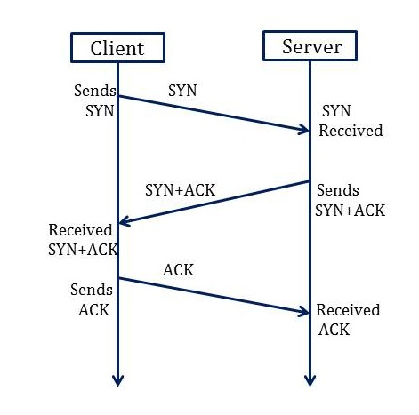

1. 클라이언트가 서버에 연결을 요청할 때 SYN 메시지를 서버에 보낸다. (`SYN` flag = 1).
* 메시지에 포함될 수 있는 것들
** Sequence Number
** ACK
** window size
** maximum segment size (만약, window size가 3000 bit 일 경우 maximum segment size는 300 bit이다)
2. 서버는 클라이언트에게 SYN과 ACK 메시지로 응답한다. 동기화 요청을 받은 이후 서버는 `ACK` 플래그를 1로 변경하여 클라이언트에게 승인 메시지를 보낸다. ACK의 번호는 수신한 Sequence Number 보다 1 크다.
3. 클라이언트는 서버에 ACK 메시지를 보낸다. 서버로부터 SYN을 수신한 후 `ACK` 플래그를 1로 설정하여 서버의 SYN Sequence Number보다 1 큰 번호를 함께 전송한다. (이때부터 `SYN` 플래그는 0이 된다.)

=== 데이터 재전송
송신자가 보낸 하나 또는 일부의 TCP 세그먼트는 수신자에게 도착하기 이전에 손실될 수 있다.
이 때 수신자는 동일한 ACK 번호가 포함된 acknowledment를 송신자에게 보낸다. 이 후 송신자는 해당 세그먼트를 수신자에게 다시 전송한다.

송신자::
* 타임아웃 타이머가 만료 되었을 때 +
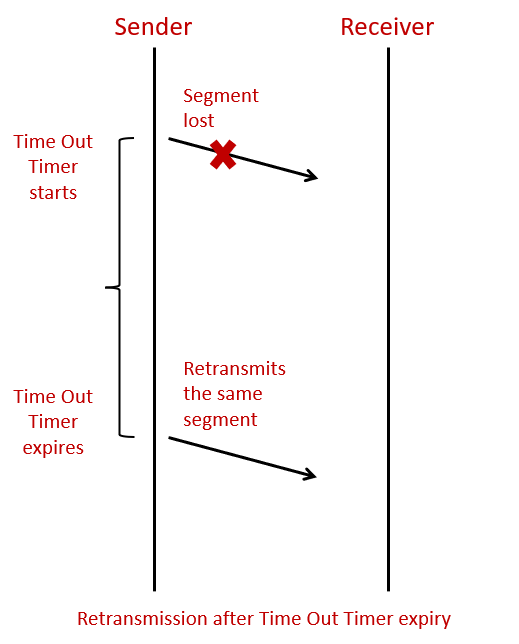
** 보낸 세그먼트에 대한 ACK를 받지 못한다면 송신자는 세그먼트가 손실되었다고 가정하고 동일한 세그먼트를 다시 보낸이 후 타이머를 재설정 한다.

* 3개의 중복된 acknowlegment를 받았을 때 +
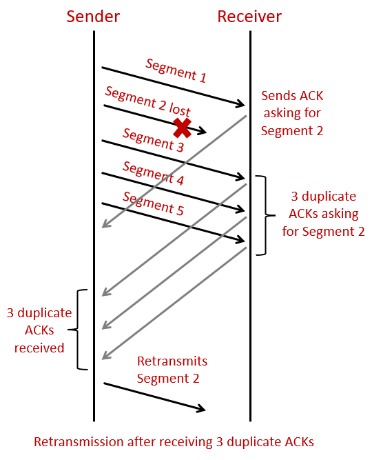
** 송신자는 타이머가 만료되는것을 기다리지 않고 바로 손실된 세그먼트를 전송한다. (fast retransmission)

=== 4 way handshake (커넥션 종료)

image:images/4_way_handshake.png[]

1. 클라이언트는 더이상 보낼 데이터가 존재하지 않으므로 `FIN` flag를 전송한다. (이때 클라이언트는 FIN_WAIT 상태이다.)
2. 서버는 수신받은 FIN flag에 대한 ACK를 클라이언트에게 응답하고 자신의 통신이 끝날 때 까지 기다린다. (이때 서버는 CLOSE_WAIT 상태이다.)
3. 연결을 종료할 준비가 되면 서버는 클라이언트에게 `FIN` flag를 전송한다. (이때 서버는 LAST_ACK 상태이다.)
4. 클라이언트는 수신한 `FIN` flag에 대한 응답 ACK를 전송한다. (클라이언트의 상태가 FIN_WAIT -> TIME_WAIT으로 변경된다. 일정 시간이 지나면 CLOSE 상태로 변화한다.)

=== TCP 상태도

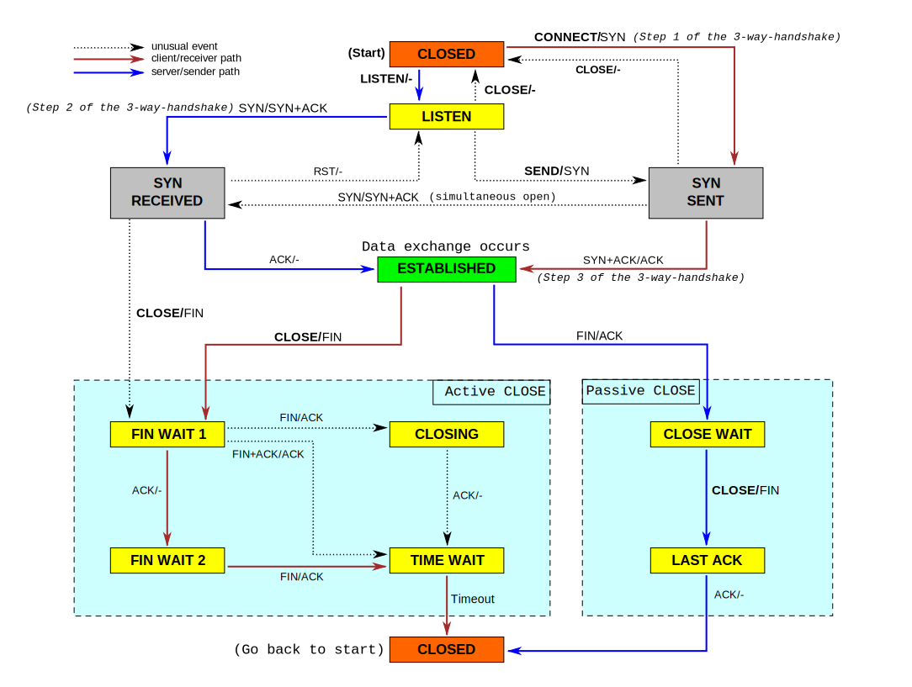

TIME_WAIT::
2MSL 대기 상태 (2Maximum Segment Lifetime - 패킷이 폐기되기 전에 네트워크에서 살아있을 수 있는 시간)
* 모든 패킷은 TTL(time-to-live)라는 값을 가진다. 해당 값이 0이 되면 폐기된다. 모든 라우터는 패킷을 통과시킬 때 해당 값을 1씩 감소시킨다.
* 소켓이 TIME_WAIT 상태가 되면 MSL의 두배만큼의 시간동안 TIME_WAIT 상태를 유지한다. (ACK 패킷이 TTL에 의해 소실되어도 ACK 패킷을 재전송하여 FIN 패킷이 재전송 될 수 있다.)
* TIME_WAIT 상태가 끝나면 CLOSED 상태가 된다.

TIME_WAIT이 필요한 이유::
1. 지연 패킷 문제
* 송신한 데이터를 모두 수신하기 전에 새로운 연결이 진행되었다면 지연 패킷이 뒤늦게 도착해 문제가 발생한다.
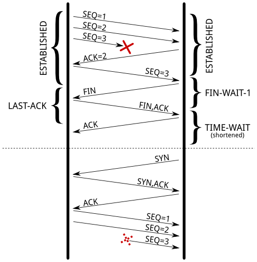
2. 연결 종료 문제
* 마지막 ACK 손실 시, 상대방은 LASK_ACK 상태에 빠지게 된다. 새로운 연결을 위해 SYN 패킷을 보내더라도 RST를 리턴하며 실패한다.
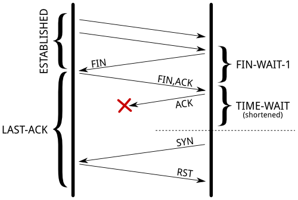

=== Flow Control
* TCP 헤더의 윈도우 크기
* 수신측에서 수신 가능한 버퍼의 크기, Flow Control에 맞게 데이터를 보내면 된다.
* 수신 애플리케이션의 데이터 수신 속도와 관계가 있다.

=== Congestion Control
* network의 문제이다.
* 네트워크가 명시적으로 혼잡도를 알려주지 않으므로 TCP가 열심히 추측해야 한다.
* 혼잡제어 윈도우를 활용한다. (Congestion window - CWND, 전송 중에 있을 수 있는 승인되지 않은 패킷의 수를 제한한다.)

[source]
----
jangjaehun@jangjaehuns-MacBook-Air ~ % netstat -i
Name       Mtu   Network       Address            Ipkts Ierrs    Opkts Oerrs  Coll
lo0        16384 <Link#1>                        135288     0   135288     0     0
lo0        16384 127           localhost         135288     -   135288     -     -
lo0        16384 localhost   ::1                 135288     -   135288     -     -
lo0        16384 jangjaehuns fe80:1::1           135288     -   135288     -     -
gif0*      1280  <Link#2>                             0     0        0     0     0
stf0*      1280  <Link#3>                             0     0        0     0     0
anpi1      1500  <Link#4>    86:bf:21:a0:ec:ac        0     0        0     0     0
anpi1      1500  jangjaehuns fe80:4::84bf:21ff        0     -        0     -     -
anpi0      1500  <Link#5>    86:bf:21:a0:ec:ab        0     0        0     0     0
anpi0      1500  jangjaehuns fe80:5::84bf:21ff        0     -        0     -     -
en3        1500  <Link#6>    86:bf:21:a0:ec:8b        0     0        0     0     0
en4        1500  <Link#7>    86:bf:21:a0:ec:8c        0     0        0     0     0
en1        1500  <Link#8>    36:2a:eb:7a:ec:80        0     0        0     0     0
en2        1500  <Link#9>    36:2a:eb:7a:ec:84        0     0        0     0     0
ap1        1500  <Link#10>   3e:57:dc:6c:27:b5        0     0        0     0     0
en0        1500  <Link#11>   1c:57:dc:6c:27:b5   399197     0   314456     0     0
en0        1500  jangjaehuns fe80:b::81:c1d2:c   399197     -   314456     -     -
en0        1500  172.20        172.20.133.127    399197     -   314456     -     -
awdl0      1500  <Link#12>   fe:9f:78:01:89:ec   258945     0     4240     0     0
awdl0      1500  fe80::fc9f: fe80:c::fc9f:78ff   258945     -     4240     -     -
llw0       1500  <Link#13>   fe:9f:78:01:89:ec        0     0        0     0     0
llw0       1500  fe80::fc9f: fe80:d::fc9f:78ff        0     -        0     -     -
bridge0    1500  <Link#14>   36:2a:eb:7a:ec:80        0     0        0     0     0
utun0      1380  <Link#15>                            0     0        2     0     0
utun0      1380  jangjaehuns fe80:f::655f:d1c0        0     -        2     -     -
utun1      2000  <Link#16>                            0     0        2     0     0
utun1      2000  jangjaehuns fe80:10::8b5f:cf0        0     -        2     -     -
utun2      1000  <Link#17>                            0     0        2     0     0
utun2      1000  jangjaehuns fe80:11::ce81:b1c        0     -        2     -     -
utun3      1380  <Link#20>                           94     0       99     0     0
utun3      1380  jangjaehuns fe80:14::4731:a54       94     -       99     -     -
utun4      1380  <Link#21>                            0     0        2     0     0
utun4      1380  jangjaehuns fe80:15::f4bd:dfb        0     -        2     -     -
en5        1500  <Link#18>   a0:ce:c8:95:a1:7e        0     0        1     0     0
en6*       1500  <Link#19>   86:ab:1a:24:08:e0     2175     0     2231     0     0
----

== L3 Network Layer
* 네트워크 계층 프로토콜은 데이터의 비트와 바이트가 패킷이라 불리는 더 큰 그룹으로 어떻게 구성되는지, 서로 다른 기기가 서로를 찾는 데 사용되는 주소 지정 방식을 정의한다.
* 대표적인 네트워크 계층 프로토콜은 IP - Internet Protocol 이다.

TIP: IPv4와 IPv6 모두 데이터그램이라는 패킷을 통해 전송된다. +
IPv4 데이터그램에는 20~60 바이트 길이의 헤더와 최대 65,515 바이트를 포함하는 페이로드가 있다. +
IPv6 데이터그램에는 더 큰 헤더와 최대 4 기가바이트의 데이터가 포함될 수 있다.

=== IPv4

Protocol::
[source]
----
1 	ICMP 	Internet Control Message 		[RFC792]
2 	IGMP 	Internet Group Management 		[RFC1112]
6 	TCP 	Transmission Control 		[RFC-ietf-tcpm-rfc793bis-28]
8 	EGP 	Exterior Gateway Protocol 		[RFC888][David_Mills]
9 	IGP 	any private interior gateway (used by Cisco for their IGRP) 		[Internet_Assigned_Numbers_Authority]
17 	UDP 	User Datagram 		[RFC768][Jon_Postel]
----

Address::
* 4 바이트로 한 바이트 씩 숫자로 읽어서 표시한다.
[source]
----
223.1.1.1 // 네트워크 주소 : 223.1.1    호스트 주소 : 1
----

Netmask : 네트워크 주소 부분의 비트를 1로 치환한 것. 255.255.255.0

TIP: IP 주소와 넷마스크를 AND 연산을 하면 네트워크 주소를 얻을 수 있다.

Subnet mask::
네트워크ID를 표시하기 위해 사용한다.

CIDR(Classess InterDomain Routing)::
임의의 길이로 서브넷을 할 수 있다. +
[source]
----
a.b.c.d/x
----
x -> subnet bit. +
ex ) `223.1.1.0/24`

=== Router

포워딩::
* 포워딩 테이블을 참조하여 데이터를 전달한다.

라우링::
* 포워딩 테이블을 만든다.

[source]
----
|      | Network destination | Netmask         | Gateway       | Interface     | Metric |
| :--- | :------------------ | :-------------- | :------------ | :------------ | :----- |
| 1    | 0.0.0.0             | 0.0.0.0         | 192.168.0.1   | 192.168.0.100 | 10     |
| 2    | 127.0.0.0           | 255.0.0.0       | 127.0.0.1     | 127.0.0.1     | 1      |
| 3    | 192.168.0.0         | 255.255.255.0   | 192.168.0.100 | 192.168.0.100 | 10     |
| 4    | 192.168.0.100       | 255.255.255.255 | 127.0.0.1     | 127.0.0.1     | 10     |
| 5    | 192.168.0.1         | 255.255.255.255 | 192.168.0.100 | 192.168.0.100 | 10     |
----

=== NAT Network Address Translation
* IP 고갈을 걱정하여 만들어 낸 기능이다.

Private IP::
* 사설 IP 대역이 정의되어 있다. 공인 IP로는 사용되지 않는다.
[source]
----
| Name         | CIDR block     | Address range                 | Number of addresses | Classful description                    |
| :----------- | :------------- | :---------------------------- | :------------------ | :-------------------------------------- |
| 24-bit block | 10.0.0.0/8     | 10.0.0.0 – 10.255.255.255     | 16777216            | Single Class A.                         |
| 20-bit block | 172.16.0.0/12  | 172.16.0.0 – 172.31.255.255   | 1048576             | Contiguous range of 16 Class B blocks.  |
| 16-bit block | 192.168.0.0/16 | 192.168.0.0 – 192.168.255.255 | 65536               | Contiguous range of 256 Class C blocks. |
----

단점::
서버 운영이 불가능하다. +
서로 다른 NAT 환경의 두 호스트가 직접 통신하는 것은 어렵다.

=== DHCP Dynamic Host Control Protocol
* 개별 호스트에 적절한 네트워크 정보를 설정하기 위한 프로토콜.

=== ICMP Internet Control Protocol
* 네트워크 상태를 보고하기 위하 메세지

----
Type  Code  description
0        0         echo reply (ping)
3        0         dest. network unreachable
3        1         dest host unreachable
3        2         dest protocol unreachable
3        3         dest port unreachable
3        6         dest network unknown
3        7         dest host unknown
4        0         source quench (congestion
                     control - not used)
8        0         echo request (ping)
9        0         route advertisement
10       0         router discovery
11       0         TTL expired
12       0         bad IP header
----

=== 라우팅 알고리즘
link-state 알고리즘::
* 라우팅 테이블을 구성하는 알고리즘
* 전체 상태를 모두 알고 있는 상태로 가정한다.
* Shortest Path Algorithm
* OSPF Open SHortest Path First

distance-vector 알고리즘::
* 전체 그래프는 모르지만 이웃으로 부터 이웃이 알고 있는 정보를 받아서 계산하는 방법이다.
* RIP Routing Information Protocol

=== 라우팅 프로토콜
IGP - Interior Gateway Protocol::
link-state, distance-vector

EGP - Exterior Gateway Protocol::
BGP - Border Gateway Protocol

=== Autonomous System
네트워크를 독립적으로 운영할 수 있는 단위.

=== BGP Border Gateway Protocol
AS 간 라우팅에 사용하는 알고리즘이다. +
AS 는 AS Number를 부여 받는다.

== L2 Data Link Layer

* 공유하는 전송 미디어에 데이터를 여러명이 동시에 보내면 안된다. 노이즈 없이 보내야 한다.

MAC Media Access Control::
충돌이 나지 않게 관리한다.
* 종류
** channel partitioning
*** TDMA : Time Division Multiple Access - 시간을 나눠서 해결한다.
*** FDMA : Frequency Division Multiple Access - 주파수를 나눠서 해결한다.
** Random Access
*** 보낸 후 충돌이 발생하면 랜덤한 시간동안 기다렸다가 다시 시도한다.
*** CSMA : Carrier Sence Multiple Access
*** CSMA/CD : Carrier Sence Multiple Access / Collision Detection
*** Ethernet
*** CSMA/CA : Carrier Sence Multiple Access / Collision Avoidance
*** WIFI
** Taking turns
*** 중재자를 두는 케이스
*** 토큰을 돌려가며 사용하는 케이스

CSMA/CD::
1. Carrier Sence : 누가 이야기를 하는지 들어보다가 아무도 이야기를 하지 않는다면
2. 데이터를 보낸다. 보내는동안 다른 데이터가 나에게 도착한다면 충돌이 발생했다고 판단.
3. Collision Detection : 충돌이 감지되면 데이터를 보내는것을 끊고, 랜덤한 시간동안 쉬었다가 재전송한다.
* 랜덤하게 쉬는 방법
** binary exponential backoff
** 충돌 횟수가 m이라면 0 ~ 2^m-1 숫자 숭중에 랜덤하게 쉰다.

{empty}

Ethernet Frame::
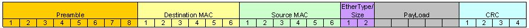
* Destination MAC Address - 6byte (목적지 MAC 주소)
* Source MAC Address - 6byte (출발지 MAC 주소)
* EtherType
* 데이터의 프로토콜 명시 대부분은 IP이다.

다음 홉의 MAC 주소는 포워딩 테이블을 보고 다음 홉을 판단한다.

=== ARP
* Address Resolution Protocol

ARP 테이블::

{empty}

[cols="2,3,1"]
|===
^s| IP 주소
^s| MAC 주소
^s| TTL

| 233.1.1.1
| 00:00:5e:00:01:06
| 1
|===

* ARP 테이블을 만드는 프로토콜
* Ethernet Frame 목적지 주소를 '브로드 캐스팅'으로 요청한다.

=== LAN
라우터를 거치지 않고 접근 가능한 영역

=== Ethernet
* Bus 형 +
전체가 Collision domain 이다.
* Star 형 +
스위치가 collision 도메인을 분리해준다.

== HTTP
웹의 자원 위치에 접근하는 프로토콜.

Hyper Text::
Link를 통해서 한 문서에서 다른 문서로 즉시 접근할 수 있는 텍스트이다.

WWW::
* World Wide Web
* Web 브라우저가 Web Server의 HTML로 기술된 리소스를 URL을 통해서 요청하여 HTTP를 사용하여 받아서 표현.

{empty}

HTML::
* Hyper Text Markup Language
[source, HTML]
----
<!DOCTYPE html>
<html>
    <head>
        <title>Welcome, NHN Academy</title>
    </head>
    <body>
        <h3> Welcome </h3>
        
 Hello, NHN Academy. 

        

            
        

    </body>
</html>
----

{empty}

URL::
* Uniform Resource Locator
* 통일된 웹 리소스의 위치 지정 방법

[source, URL]
----
<scheme>://[<username>:<password>@]<host>[:<port>]<Request-URI>[?<query>#<fragment>]
----

=== Protocol 구조
요청::

[source, console]
----
<Method> <Request URI> <Version>
<Header>

<Body>

GET /welcome.html HTTP/1.1
Host: test-vm.com:3000
Connection: keep-alive
Cache-Control: max-age=0
Upgrade-Insecure-Requests: 1
User-Agent: Mozilla/5.0 (Macintosh; Intel Mac OS X 10_12_2) AppleWebKit/537.36 (KHTML, like Gecko) Chrome/55.0.2883.95 Safari/537.36
Accept: text/html,application/xhtml+xml,application/xml;q=0.9,image/webp,*/*;q=0.8
DNT: 1
Accept-Encoding: gzip, deflate, sdch, br
Accept-Language: ko
If-Modified-Since: Sat, 15 Jan 2022 18:23:48 GMT
----

응답::

[source, console]
----
<Version> <Status Code> <Reason Phrase>
<Header>

<Body>

HTTP/1.0 200 OK
Server: SimpleHTTP/0.6 Python/2.7.13
Date: Sat, 15 Jan 2022 19:09:33 GMT
Content-type: text/html
Content-Length: 358
Last-Modified: Sat, 15 Jan 2022 18:23:48 GMT

<!DOCTYPE html>
<html>
    <head>
        <title>Welcome, NHN Academy</title>
    </head>
    <body>
        <h3> Welcome </h3>
        
 Hello, NHN Academy. 

        

            
        

    </body>
</html>
----

* status code
** 1xx : 정보제공
** 2xx : 성공
** 3xx : 리다이렉션
** 4xx : 클라이언트의 오류
** 5xx : 서버의 오류
* reason phrase(거절 사유)
** 200 OK
** 401 Unathorized
** 404 Not Found

=== GET VS POST
GET::
리소스를 요청하기 위한 메서드

[source, HTML]
----
<!DOCTYPE html>
<html>
    <head>
        <title>Welcome, NHN Academy</title>
    </head>
    <body>
        <h3> Welcome </h3>
        <form action="./welcome.html" method=GET >
          name:  
          <input type="text"     name="name"   >  
          content:  
          <input type="textarea" name="content">  
          <input type="submit"   name="send" value="send">
        </form>
    </body>
</html>
----

POST::
서버에 입력 데이터를 전송하기 위한 메서드
[source, HTML]
----
<!DOCTYPE html>
<html>
    <head>
        <title>Welcome, NHN Academy</title>
    </head>
    <body>
        <h3> Welcome </h3>
        <form action="./welcome.html" method=POST>
          name:  
          <input type="text"     name="name"   > 
          content:  
          <input type="textarea" name="content"> 
          <input type="submit"   name="send" value="send">
        </form>
    </body>
</html>
----

차이점::
[cols="1,2,2"]
|===
^s|
^s| GET
^s| POST

| 요청 주소
| `/welcome.html?name=TEST-NAME&contenmt=TEST-CONTENT&send=send`
| `welcome.html`

| 헤더
| `Content Type`, `Content Length` 헤더 없음
| `Content Type: application/x-www-form-urlencoded`, `Content Length: 45`
|===

GET은 전송 데이터의 길이에 제한이 있다.

=== 인증, 쿠키, 세션
Stateless::
Server-Client 관계에서 server가 client의 상태를 보존하지 않음.

Cookie::
서버가 클라이언트에게 쿠키를 세팅 요청(`Set-Cookie`)하면 클라이언트는 서버에게 보내는 요청 헤더에 (`Cookie: `)를 표시해서 전송
* Session Cookie (세션 쿠키)
** 사용자가 브라우저를 사용하는 동안만 유효하다.
** 브라우저는 사용자가 브라우저를 사용하는 동안 Cookie 정보를 서버로 전달한다.
* Persistene Cookie (지속 쿠키)
** 사용자가 브라우저를 종료해도 유지되는 쿠키

Set Cookie?::
* 사용 세션 관리
* 개인화
* 사용자 추적

Session::
* 사용자 접속 시점에 임의의 세션 ID를 발급한다.
* 해당 세션 ID를 키로 하여 서버 저장소에 필요한 정보를 저장한다.

