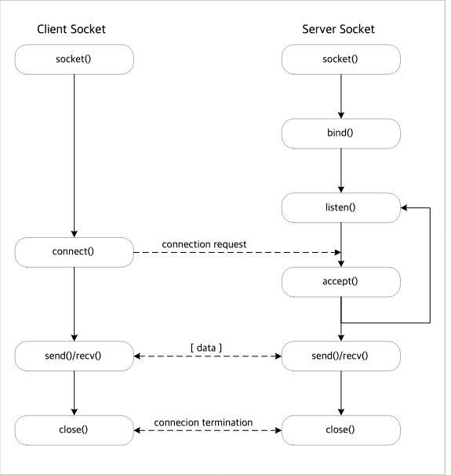

== Socket 통신

=== Server Socket
> Server socket은 client socket의 연결 요청을 대기하고, 연결 요청이 오면 client socket을 생성하여 통신이 가능하도록 제공

_Server socket의 동작 과정_

* socket() : 소켓 생성
* bind() : 대기 소켓의 IP 주소와 Port 설정
* listen() : 클라이언트 소켓 연결 요청 대기
* accept() : Client socket 연결 요청이 오면 accept() 함수를 이용해 연결을 승인
* send()/recv() : Client Socket과 데이터를 주고 받음
* close() : Client Socket이나 생성된 socket을 닫으면 상대 socket도 close()

=== Client Socket
* socket() : 소켓 생성
* connect() : 지정된 server에 연결 요청 -> Server에서 연결을 accpet()하면 데이터를 주고 받음
* close() : 데이터 송수신이 완료되거나 서버 소켓이 닫히면 close