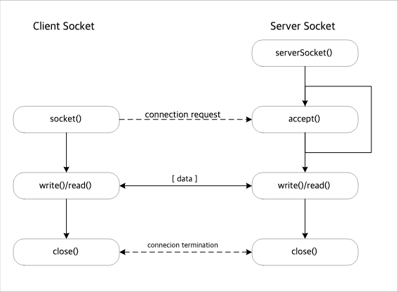
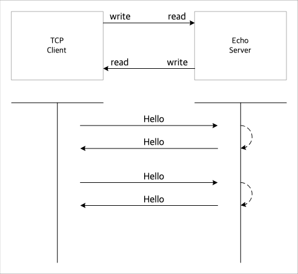

== Java Socket 통신

=== Java Socket
* Socket Class
* ServerSocket Class

위의 두 클래스 지원



=== Class Socket

```java
Socket socket = new Socket(hostIp, port);
```


=== Echo server
* client가 server에 연결하여 message를 보내면, 그대로 반환


=== 비동기 통신
*