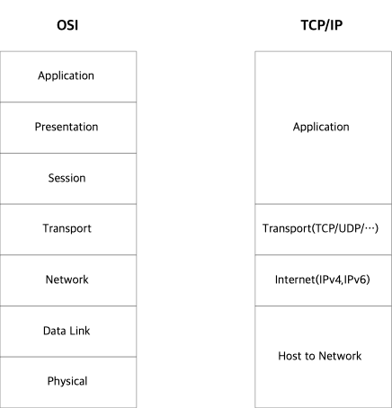

= Computer Network

* 서로 데이터를 교환하고 자원을 공유할 수 있는 Computing device의 집합
* Protocol을 사용하여 통신 (다양한 형태의 Protocol)

== Node
* Message 전달을 위해 중간 연결 역할을 수행하는 device

=== Node 종류
* Network Interface
* Repeater and Hub
* Bridge
* Switch
* Router
* Modem
* Firewall

==== Network Interface
* Network 간의 상호 연결 지점

* 일반적으로 NIC(Network Interface Controller)와 같은 물리적인 디바이스를 이야기 한다.
** Network Interface Controller : Network에 연결될 수 있도록 지원하는 하드웨어 장치

* Loopback Interface와 같이 가상 디바이스로도 구현이 가능

==== Reapeater
* 장거리 전송 -> 신호 품질 저하를 줄임
** 신호 증폭: 장거리 전송에 따른 신호 감소 문제 해결
** 신호 처리: 외부로부터 유입된 노이즈 제거

* 전송 거리나 환경 요인을 극복하기 위해 물리적 전송 매체를 변경할 수 있음.
** 장거리 대용량 데이터 전송 -> 광 케이블 사용
** 육지와 섬 통신 -> 무선 통신 사용

==== Hub
* Repeater와 동일하게 통신 거리 연장에 이용
* Repeater와 달리 여러 개의 포트를 가지고 있음
* Repeater는 1:1 통신 사이에 들어가지만, Hub는 1:N 통신 사이에 들어감

==== Bridge
* OSI model - Data Link Layer
* 두 네트워크 세그먼트를 연결하여 하나의 네트워크처럼 동작하도록 지원 -> 세그먼트 충돌 방지

==== Switch
* OSI model - Data Link Layer
* 둘 이상의 네트워크 세그먼트를 연결하여 하나의 네트워크처럼 동작하도록 지원
* N개의 네트워크 세그먼트가 충돌을 방지할 수 있음.

==== Router
* OSI model - Network Layer
* 네트워크간 패킷 전달에 이용됨
* Routing 정보를 이용하여 경로를 정할 수 있음.

==== Modem
* OSI model - Physical Layer
* Modulator-Demodulator에서 나온 단어
* 디지털 데이터 <--> 아날로그 데이터

==== Firewall
* 네트워크 보안 및 접근 규칙을 제어하기 위한 장치 또는 소프트웨어
* 안전한 내부 네트워크와 인터넷과 같이 잠재적으로 안전하지 않은 외부 네트워크 사이에 연결에 삽입
* 사전에 설정되지 않은 접근에 대해서 차단을 기본으로 함

{empty} +

== Protocol (프로토콜)
* 네트워크를 통해 정보를 주고 받을 때 지켜야하는 일련의 규칙
* 프로토콜 스택
** IEEE 802.11 (Wi-Fi Protocol)
** IP (Internet Protocol)
** HTTP (WWW Protocol) - TCP를 통해 실행

== Network Layer
* Collision Avoidance (충돌 회피)
** 여러 기기가 동시에 데이터 전송하려고 할 때 충돌이 발생할 수 있음
** CSMA/CD 또는 CSMA/CA와 같은 프로토콜 활용

* Digital to Analog Conversion (디지털 -> 아날로그 변환)
** 변조 기술 사용

* Error Detection and Correction(오류 감지와 수정)
** Checksum, Parity Bit, Reed-Solomon Code와 같은 기술을 사용 -> 데이터 무결성 보장

* Routing (경로 지정)
** OSFP, BGP, RIP와 같은 경로 지정 프로토콜 활용 -> 최적 경로 설정

* Operating System Compatibility (운영체제 호환성)

* Heterogeneous Network Cabling (이질적인 네트워크 케이블링)
* Ethernet, Wi-Fi, 광섬유 등 다양한 종류의 케이블을 포함한 다양한 물리적 인프라를 가질 수 있음.

* Network Protocol
** 데이터 구조, 전송 및 수신 방식을 규정
** TCP/IP, HTTP, FTP 포함
** 호환성과 신뢰성 있는 데이터 전송을 보장

* Security
** 암호화, 인증, 보안 프로토콜 활용하여 보안 문제를 다룸

* Quality of Service(QoS - 서비스 품질)
** 중요한 데이터가 우선 처리도되록 보장 (실시간 통신 -> 음성, 영상)

* Scalability (확장성)
** 데이터 트래픽 및 장치 연결 수용하기 위해 효율적으로 확장 가능해야 함

== OSI Model
* 네트워크 기능을 계층으로 분리
* OSI(Open Sysetm Interconnection) Model 또는 TCP/IP Model로 불린다.

[cols="1, 2", %autowidth, optios="headers"]
|===
| Layer |

| Application | 응용 프로그램별 프로토콜 및 데이터 형식 처리 +
사용자 수준 응용 프로그램(웹 브라우저, 파일 전송 등)이 작동
| Presentation | 데이터 번역, 압축 및 암호화 담당 +
데이터가 발신자와 수신자 모두 읽을 수 있는 형식으로 제공됨을 보장
| Session | 통신 세션을 설정, 관리 및 종료 +
세션 동기화 및 대화 제어를 처리
| Transport | 발신자와 수신자 간의 종단 간 통신을 보장 +
데이터 분할, 흐름 제어 및 오류 정정을 관리 +
`TCP`, `UDP`
| Network | 패킷을 출발지에서 목적지로 라우팅 +
`IP(Internet Protocol)`
| Data Link | 직접 연결된 두 노드간의 신뢰할 수 있는 링크를 만듦 +
프레임 형식, 오류 감지 및 흐름 제어와 같은 문제 처리 +
`Ethernet`
| Physical | 실제 데이터 전송 (전선, 광섬유) +
하드웨어 특성, 신호 및 전송 속도 정의
|===

== TCP/IP Model

[cols="1, 2", %autowidth, optios="headers"]
|===
| Layer |

| Application | TCP/IP 인터넷 전체에서 사용 가능한 서비스에 접근하는 사용자 호출 응용 프로그램으로 구성 +
응용 프로그램은 데이터를 전송 레이어로 전달하기 위해 필요한 형식으로 전달

| Transport | 한 응용 프로그램에서 다른 응용 프로그램으로 통신을 제공하는 것이 주 목적 +
전송되는 데이터 스트림을 `Packet` 이라고 하는 작은 조각으로 나누고 각 패킷과 목적지 정보를 다음 레이어로 전달 +
{empty} +
Transport Layer는 `TCP`, `UDP` 로 구성 +
- TCP(Transfer Control Protocol) : COTS (Connection-Oriented Transport Service) +
- UDP(User Datagram Protocol) : CLTS (ConnectionLess Transport Service) +

| Internet | 한 대의 기계에서 다른 대의 기계로의 통신 처리 +
Transport Layer에서 데이터를 전송하도록 요청을 수락, 데이터를 전송할 기계의 식별 정보를 받음 +
데이터 -> IP Datagram으로 래핑 후 헤더를 채우며, 전달 방법을 결정하기 위해 라우팅 알고리즘 사용 +
데이터그램을 전송하기 위해 적절한 장치 드라이버에 전달

| Host to Network | 네트워크 인터페이스, 패킷을 수신하고 특정 네트워크를 통해 전송하는 역할을 담당 +
Network Interface는 장치 드라이버 또는 자체 데이터 링크 프로토콜을 사용하는 복잡한 서브 시스템으로 구성될 수 있음.

|===

