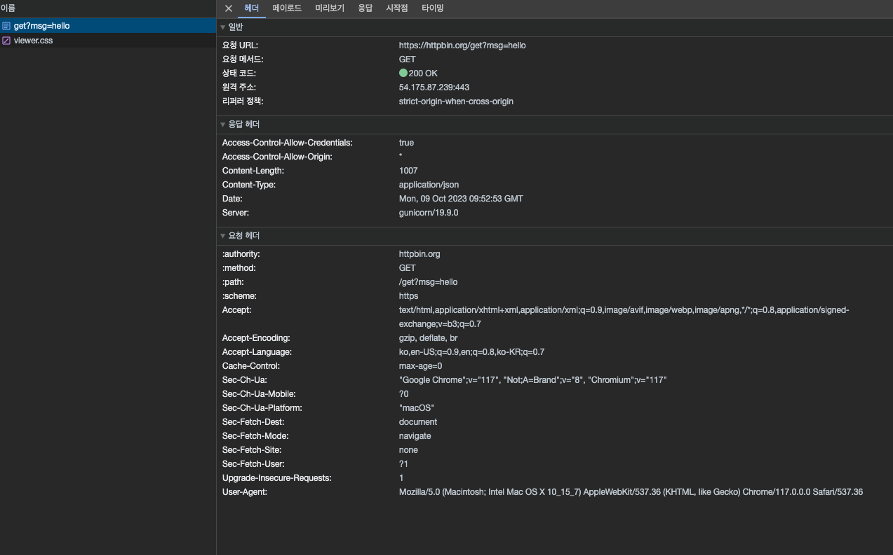

= L7 Application Layer

* 데이터를 사용자에게 전달하는 계층
* 데이터가 전송된 후 어떻게 처리할지 결정 (HTTP Protocol -> 웹 브라우저가 이미지를 긴 스트림이 아닌 그림으로 표시하도록)

== 종류
* 웹 - HTTP
* 이메일 - SMTP, POP, IMAP
* 파일 전송 - FTP, FSP, TFTP
* 파일 접근 - NFS
* 파일 공유 - Gnutella, BitTorrent
* 음성 통신 - SIP(Session Initiation Protocol), Skype
* 필요한 경우 정의 가능

=== HTTP (Hyper Text Transfer Protocol)

1. chrome에서 확인

2. curl 프로그램으로 확인
[source,shell]
----
curl https://httpbin.org/get
curl -v https://httpbin.org/get
----

3. nc 프로그램으로 확인

[source,shell]
----
nc httpbin.org 80
----
여기서의 80은 http 포트 번호 -> link:https://ko.wikipedia.org/wiki/TCP/UDP%EC%9D%98_%ED%8F%AC%ED%8A%B8_%EB%AA%A9%EB%A1%9D[Well Known Port Number 위키백과]