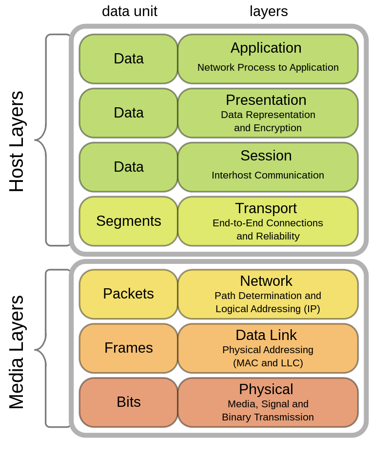
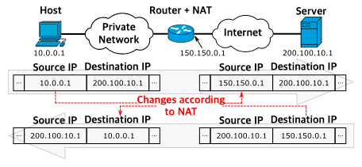

= L3 Network Layer

* 데이터의 비트와 바이트가 패킷이라고 불리는 더 큰 그룹으로 어떻게 구성되는지, 서로 다른 기기가 서로를 찾는 데 사용되는 주소 지정 방식을 정의
* Internet Protocol (IP)는 널리 사용되는 네트워크 계층 프로토콜 -> Java가 유일하게 이해하는 네트워크 계층 프로토콜
* IPv4 데이터그램: 20 ~ 60 Byte 길이의 헤더와 최대 65,515 Byte의 데이터를 포함하는 Payload를 가짐
* IPv4 데이터그램: 더 큰 헤더와 최대 4GB의 데이터가 포함될 수 있음.


_Data Unit in Layer_


== IP (Internet Protocol) - IPv4
image:images/ipv4.png[IPv4]

{empty} +

=== IPv4 protocol
```
1 	ICMP 	Internet Control Message 		[RFC792]
2 	IGMP 	Internet Group Management 		[RFC1112]
6 	TCP 	Transmission Control 		[RFC-ietf-tcpm-rfc793bis-28]
8 	EGP 	Exterior Gateway Protocol 		[RFC888][David_Mills]
9 	IGP 	any private interior gateway (used by Cisco for their IGRP) 		[Internet_Assigned_Numbers_Authority]
17 	UDP 	User Datagram 		[RFC768][Jon_Postel]
```

=== IPv4 Address
* 4bytes
* 보통 한 바이트씩 숫자로 읽어서 표시

```
[ip]
192.1.1.1

[netmask]
255.255.255.0
```

=== Subnet mask
* 네트워크 ID를 표시하기 위해 사용

==== Subnet
* 라우터를 통하지 않고 갈 수 있는 네트워크
** 223.1.1
** 223.1.2
** 223.1.3

=== IP Addressing: CIDR[Classless InterDomain Routing]
* 임의의 길이로 서브넷을 알 수 있음.
```
[형식]
192.168.0.0/24 => [IP주소 / subnet bit]
```


== Router
=== 포워딩
* 포워딩 테이블을 참조하여 데이터를 전달
* Network ID 기준

=== 라우팅
* 포워딩 테이블을 만듦


```
| Network destination | Netmask | Gateway | Interface | Metric |
| :---|:------------------ | :-------------- | :------------ | :------------ | :----- |
| 1 | 0.0.0.0 | 0.0.0.0 | 192.168.0.1 | 192.168.0.100 | 10 |
| 2 | 127.0.0.0 | 255.0.0.0 | 127.0.0.1 | 127.0.0.1 | 1 |
| 3 | 192.168.0.0 | 255.255.255.0 | 192.168.0.100 | 192.168.0.100 | 10 |
| 4 | 192.168.0.100 | 255.255.255.255 | 127.0.0.1 | 127.0.0.1 | 10 |
| 5 | 192.168.0.1 | 255.255.255.255 | 192.168.0.100 | 192.168.0.100 | 10 |
```

```shell
[zsh]
% netstat -rn

- Destination: 패킷이 전송되는 목적지의 IP 주소 또는 네트워크.
- Gateway: 패킷을 해당 목적지로 전달하는 라우터의 IP 주소.
- Flags: 해당 경로에 대한 다양한 속성을 나타내는 플래그.
- Refs: 이 경로를 참조하는 소켓의 수.
- Use: 이 경로를 통해 전송된 패킷의 수.
- Netif: 이 경로에 대한 네트워크 인터페이스 이름.
```

=== NAT (Network Address Translation)


* IP 고갈을 걱정하여 만들어낸 기능
* SRC PORT도 변경 가능
* 서버 입장에서 클라이언트 IP가 동일하게 보이는 현상이 존재할 수 있음.

==== NAT 단점
* 서버 운영이 불가능
* 서로 다른 NAT 환경의 두 호스트가 직접 통신하는 것은 어려움

=== DHCP (Dynamic Host Control Protocol)
* 개별 호스트에 적절한 네트워크 정보를 설정하기 위한 프로토콜
* IP, subnet mask or prefix, router, DNS

=== ICMP (Internet Control Message Protocol)
* 네트워크 상태를 보고하기 위한 메시지
* TTL을 넘어가는 경우 source에 알려줌

```shell
$ traceroute naver.com  # mac
```


== Routing Algorithm

* IGP (Interior Gateway Protocol)
** link-state
** distance-vector

* EGP (Exterior Gateway Protocol)
** BGP Border Gateway Protocol

=== link-state 알고리즘
* 라우팅 테이블을 구성하는 알고리즘
* 전체 그래프 상태를 알고있는 상태로 가정 -> 서로 알고있는 정보를 broadcasting

* Shortest Path Algorithm - `Daijksta`
* Open Shortest Path First - `OSPF`

=== distance-vector 알고리즘
* 전체 그래프는 모르지만, 이웃으로부터 이웃이 알고있는 정보를 받아서 계산하는 알고리즘

* `RIP` (Routing Inforamtion Protocol)


== Autonomous System
* Autonomous 자치권을 가진 시스템
* 네트워크를 독립적으로 운영할 수 있는 단위 -> 회사, ISP ...
* AS 내에서는 IGP 사용

=== BGP (Border Gateway Protocol)
* AS간 라우팅에서 사용하는 알고리즘 (inter AS Routing)
* AS는 AS Number를 부여
* AS간 라우팅은 계약에 따라 진행 - 어떻게 연결되어있는지 확인 가능